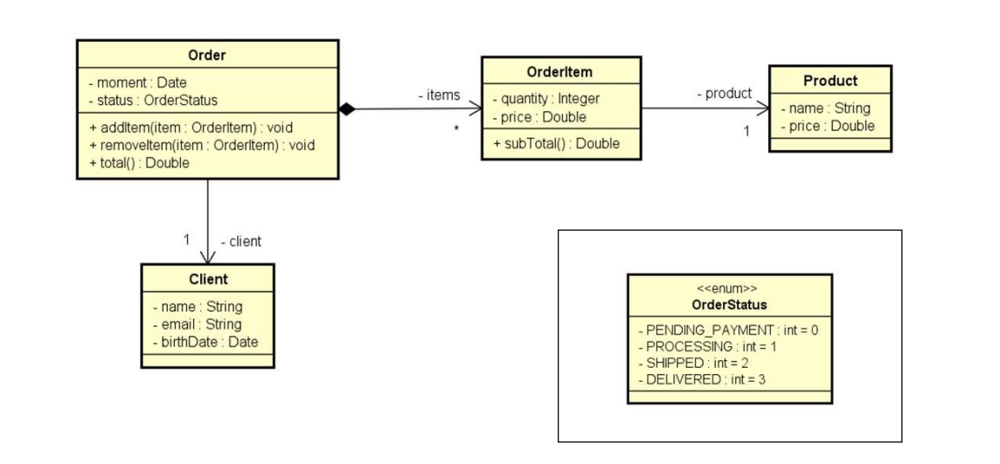

# Exercício de Fixação - Sistema de Pedido

Ler os dados de um pedido com N itens (N fornecido pelo usuário). Depois, mostrar um  
sumário do pedido conforme exemplo (próxima página). Nota: o instante do pedido deve ser  
o instante do sistema: `DateTime.Now`

---

### ✅ O sistema deve:
- Ler os dados de um pedido com **N itens** (sendo N fornecido pelo usuário).  
- O instante do pedido deve ser o instante atual do sistema (`DateTime.Now`).  
- Após a leitura dos dados, deve ser exibido um **sumário** contendo as informações do cliente, do pedido, e dos itens comprados com seus subtotais e valor total.

---

### 🧩 Diagrama de Classes



---

### 🧾 Exemplo de como deve ficar:

```bash
Enter cliente data:
Name: Alex Green
Email: alex@gmail.com
Birth date (DD/MM/YYYY): 15/03/1985

Enter order data:
Status: Processing
How many items to this order? 2

Enter #1 item data:
Product name: TV
Product price: 1000.00
Quantity: 1

Enter #2 item data:
Product name: Mouse
Product price: 40.00
Quantity: 2

ORDER SUMMARY:
Order moment: 20/04/2018 11:25:09
Order status: Processing
Client: Alex Green (15/03/1985) - alex@gmail.com
Order items:
TV, $1000.00, Quantity: 1, Subtotal: $1000.00
Mouse, $40.00, Quantity: 2, Subtotal: $80.00
Total price: $1080.00

